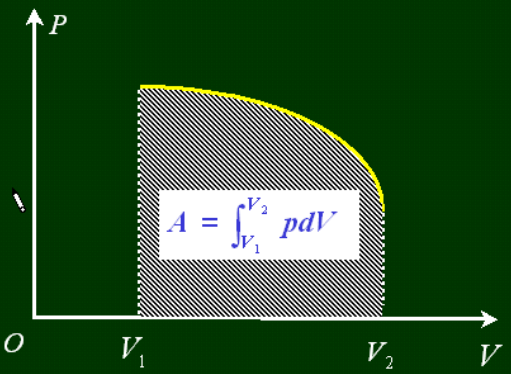

# 大学物理补天
## 5 刚体力学
### 刚体运动的描述
#### 刚体的定义  

任何情况下体积和形状都不改变的物体（理想化的模型）  

刚体是特殊的质点系，其上各质点的相对位置不变。  
#### 刚体的运动  

1、平动（平移）：刚体内任意两点连线方向保持不变  

2、转动

#### 自由度  

（1）定轴转动：$i=1$,自由度$1$；  

（2）定点转动:$i=3$,轴方向$2$,绕轴方向$1$;  

（3）刚体平面平行运动：每一点都平行于某一固定平面$i=3$，质心平移$2$，绕质心转动$1$；  

 （4）一般运动：刚体一般运动可分解为绕基点转动和基点的平动$i=6$；  

#### 角量  

 作用：定轴转动时的描述  

 角速度：$\omega=\frac{d\varphi}{dt}$（方向由右手螺旋法则确定） &ensp;角加速度：$\beta=\frac{d^2\varphi}{dt^2}$  
 
 在定轴转动下，转轴上任取一点为坐标原点，有

$$\vec{v}=\vec{\omega}\times\vec{r}$$

$$|\vec{\omega}\times\vec{r}|=\omega\cdot \rho=\omega\cdot r \sin{\theta}$$

 角加速度矢量：$\vec\alpha=\frac{d\vec{\omega}}{dt}$  
 切向加速度:$\vec{a_t}=\frac{d\vec{\omega}}{dt}\times\vec{r}$  
 法向加速度：$\vec a_n=\omega^2r\sin{\alpha}\vec{e_n}$  
 角位移不存在  
 $\star$无穷小角位移是矢量  

#### 力矩  

 作用于定轴刚体的合外力矩：$\Sigma \vec{M_i}=\vec{R_i}\times\vec{F_i}$
   
   $M_{iz}=|\vec{r_i}\times\vec{F_i}|=r_iF_i\sin{\theta_i}$,力$F_i$对$o'$的力矩在z轴上的分量（力$F_i$对转轴的力矩）  

### 刚体定轴转动定理
（经过一大堆的证明过程）  
&ensp;$M_z=J\cdot\alpha$  
又有$M=\frac{dL}{dt}$可以得出$L=J\cdot\omega$  

- ex.存在一定滑轮，质量为$m$,半径为$r$,转动惯量为$J$,上有一细绳，两端挂两物体$m_1,m_2$,求轮子的角加速度和绳子张力；（作者水平有限，图片请自行绘画）  
解：设绳子两端拉力分别为$T_1,T_2$,物体加速度为$a$,可列出方程组：

$$
\begin{cases}
m_1g-T_1=m_1a, \\\\
T_2-m_2g=m_2a, \\\\
T_1r-T_2r=J\alpha, \\\\
\alpha=a/r,
\end{cases}
$$  

### 转动惯量的计算  

$$J=\Sigma\Delta m_i r_i^2$$  

反映了转动状态改变难易程度（质量连续可用积分）
#### 平行轴定理

 刚体对任意转轴的转动惯量$J$，等于对质心转动转动惯量$J_c$加上转轴间距平方$d$乘以$m$

$$J=J_c+md^2$$

#### 几个常见的物体的转动惯量
| 物体                   | 表达式                                                       | 
| ----------------------- | ------------------------------------------------------------ |
|质点（距转动中心$r$）|$J=mr^2$|
|棒（绕端点转）|$J=\frac{1}{3}mr^2$|
|棒（绕中心转）|$J=\frac{1}{12}mr^2$|
|薄圆环(半径为$R$,转轴垂直圆环)|$J=mR^2$|
|薄圆环(半径为$R$,转轴平行圆环)|$J=\frac{1}{2}mR^2$|
|圆柱(半径为$R$)|$J=\frac{1}{2}mR^2$|
|厚圆环(半径为$R_内，R_外$)|$J=\frac{1}{2}m(R_内^2+R_外^2)$|
|球（半径为R）|$J=\frac{2}{5}mR^2$|
|球壳（半径为R）|$J=\frac{2}{3}mR^2$|
|长方体（长宽为$a,b$）|$J=\frac{1}{12}m（a^2+b^2）$|

### 定轴转动角动量定理

$M=0,J\omega=J_0\omega_0=常量$

适用：刚体、非刚体、物体系

### 刚体顶轴转动功能原理

 - 刚体转动动能
  $E_{kr}=\frac{1}{2}J\omega^2$
   
    由$J=J_c+md^2$得到

$$E_{kr}=\frac{1}{2}J_c\omega^2+\frac{1}{2}mv^2$$  

 - 力矩的功  

 $m_i$在$F_i$下转过$r_i$

$$
 dA_i=F_i\cos{\theta_i}ds_i=F_i\cos{\theta_i}r_id\varphi=M_id\varphi
$$

$$ 
M_i:力F_i相对于轴的外力矩
$$

$$即A_i=\int^\varphi_{\varphi_0}M_id\varphi$$  

合外力矩$A=\sum A_i$

 - 刚体顶轴转动的功能定理

$$A=\int^\varphi_{\varphi_0}Md\varphi=\frac{1}{2}J\omega^2-\frac{1}{2}J\omega^2_0$$

 - 刚体顶轴转动功能原理  

$$\int ^\varphi_{\varphi_0}Md\varphi=(mgz_c+\frac{1}{2}J\omega^2)-(mgz_{c_0}+\frac{1}{2}J\omega_0^2)$$  

- 进动  

$$\Omega（进动角动量）=\frac{mgl}{J\omega}$$

### 刚体平面平行运动  

基点在平面中平动+在基点垂直平面轴的定轴转动，刚体作平面平行运动时相对任一转轴角速度相同，记为$\omega$.

### 平面平行动力学

在动力学中往往取质心作为基点  
分解为：质心平动+绕质心垂直平面轴作定轴转动  

$$
\begin{cases}
\Sigma_iF_i=m\vec{a_c},\\
M_z=J_c\beta,
\end{cases}
$$

$\vec{M_{c外}}=\frac{d\vec{L_c}}{dt}$  

惯性力相对质心不产生力矩$\vec{M_l}=-\Sigma_i\vec{r_i}\times m_i\vec{a_i}=\vec{a_i}\times\Sigma_ir_im_i$  

### 滚动  
 - 有滑：$f_滑$已知，平动方程+转动方程；
 - 无滑：摩擦力未知：平动+转动+约束； 

$$
 约束
 \begin{cases}
 v_c=R\omega,\\\\
 a_c=R\beta,
\end{cases}
$$

- 补充例题：为防止汽车翻车，在车上装一大飞轮  

（1）飞轮方向，俯瞰逆时针旋转，飞轮什么方向转动  
（2）汽车质量M，行驶速度为$v$，飞轮质量$m$，半径为$R$,质心离地$h$,左右轮负荷相等，求飞轮角速度$\omega$  
分析：角动量在变，左右轮受力不相等，需要飞轮角动量改变来平衡这一点。

 (1)轴垂直车
 
 (2)轮子角动量变化与质心系力矩平衡

 $|\frac{d\vec{L}}{dt}|=L\Omega=(m+M)\frac{v^2}{r}h=\frac{1}{2}mR^2\omega\frac{v}{r}$  

## 6 振动力学基础

### 振动的不同形式
机械、电磁
广义振动：某一物理量在某一数值附近反复变化。

$$
\begin{cases}
受迫振动 \\
自由振动 \begin{cases}
有阻尼 \\
无阻尼
\end{cases}
\end{cases}
$$

### 运动学

$$x(t)=A\cos{(\omega t+\varphi)}$$

特点：等幅振动、周期振动  
特征量：振幅$A$、周期$T$和频率$\nu$,$\nu=\frac{1}{T}(Hz)$，角频率$\omega=\frac{2\pi}{T}$  
相位：$\omega t+\varphi$为t时刻的相位，描述运动状态。  

## 7 相对论

<!--引用kumikosjtu.github.io开始-->

### 经典力学的困难

在 $S$ 系中空间各点放置无穷系列的时钟，这些时钟与该惯性系保持相对静止、彼此同步。一个事件的时空坐标 $(x,y,z,t)$ 由该事件发生的地点及该处的时钟记录下来。

#### 同时性和时间间隔的绝对性

**同时性**

$$t_2=t_1, t_2'=t_1'$$

**时间间隔**

$$\Delta t=t_2-t_1$$

$$\Delta t'=t_2'-t_1'=\Delta t$$

#### 空间间隔的绝对性

在 $S$ 系中 $P_1:(x_1,y_1,t_1)$，$P_2:(x_2,y_2,t_2)$ 推出 $L=x_2-x_1$。（同时测量）

在 $S'$ 系中 $P_1:(x_1',y_1',t_1')$，$P_2:(x_2',y_2',t_2')$。

得到 $L'=x_2'-x_1'=(x_2-ut_2)-(x_1-ut_1)=x_2-x_1$.

牛顿：时间和空间是与物质的存在和 **运动** 无关的，是绝对不变的。考虑物体的运动，得出了 **狭义相对论 *Special Relativity***。

#### 牛顿牛顿的绝对时空观

$$
\left\{
\begin{matrix}
x_2'-x_1'=x_2-x_1\\
t_2'-t_1'=t_2-t_1\\
\end{matrix}
\right.
$$

$$
\left\{
\begin{matrix}
v_x'=v_x-u\\
v_y'=v_y\\
v_z'=v_z
\end{matrix}
\right.
$$

$$
\left\{
\begin{matrix}
a_x'=a_x-\dfrac{\mathrm d u}{\mathrm d t}\\
a_y'=a_y\\
a_z'=a_z
\end{matrix}
\right.
$$

宏观低速物体的力学规律在任何惯性系中形式相同。力学的基本运动规律在所有惯性系中可以表示为相同形式。

#### 伽利略变换的局限性

一维电磁波动方程：

$$
\frac{\partial ^2}{\partial x^2}\Phi(x,t)-\frac{1}{c^2}\frac{\partial^2}{\partial t^2}\Phi(x,t)=0
$$

利用 $x'=x-ut$ 进行变换，发现形式上不相同。

$$
\frac{\partial^2}{\partial x'^2}\Phi-\frac{1}{c^2}\frac{\partial ^2}{\partial t'^2} \Phi+\frac{2u}{c^2}\frac{\partial ^2}{\partial x '\partial t'}-\frac{u^2}{c^2} \frac{\partial ^2}{\partial x'^2}\Phi=0
$$

光速是否符合伽利略速度变换。

**掷球实验**

$t=t_{10}=0$ 时刻 A 加速球，$t=t_1$ 时刻球出手。

$t=t_{20}=L/c$ 时刻，B 看到 A 开始投球的动作。$t=t_2=t_1+L/(c+u)$ 时刻，B 看到球离开 A 手的情况。

但是如果 $L$ 很大，得到 $L/c>t_1+L/(c+u)$，因果律被破坏。

### 狭义相对论的基本假设

1. 狭义相对性原理：一切物理规律在任何惯性系中形式相同。
2. 光速不变原理：在所有惯性系中，真空中的光速相同为 $c$，与光源和观测者的运动无关。

### 狭义相对论的时空观

#### 同时性的相对性

$S$ 地面参考系。在火车上 $A',B'$ 放置信号接收器

#### 时间间隔的相对性

相对于 $S'$ 系静止：

$$
\Delta t_0'=\frac{2d}{c}
$$

$\Delta t_0'$ 称为固有时或者本征时。

如果在 $S$ 系中观察，得到

$$
l=\sqrt{d^2+\left(\frac{u\Delta t}{2}\right)^2}\\
\Rightarrow \Delta t =\frac{2d}{c}\frac{1}{\sqrt{1-\frac{u^2}{c^2}}}=\frac{\Delta t_0'}{\sqrt{1-\frac{u^2}{c^2}}}
$$

#### 洛伦兹长度收缩

如果在 $S$ 系中尺的长度是 $L$，那么在 $S'$ 系中的观测者测量为
$$
L'=L\sqrt{1-\frac{u^2}{c^2}}
$$

 宇宙射线进入大气层时与大气微粒碰撞形成 $\mu^-$ 介子。

如果没有时间膨胀：

$$
s_0=u\tau\approx644\mathrm{~m}
$$

时间膨胀：

$$
\Delta t=\frac{\tau}{\sqrt{1-\frac{u^2}{c^2}}}
$$

$$
s=u\Delta t\approx 1.02\times 10^4\mathrm{~m}
$$

如果在 $\mu^-$ 子上看：大气层的厚度变短了。尺缩效应。

<!--引用kumikosjtu.github.io结束-->

### 洛伦兹坐标变换

设有两个惯性参考系 $S$ 和 $S'$，$x$ 轴和 $x'$ 轴方向相同而且重合，$S'$ 系相对于 $S$ 系以速度 $\boldsymbol u$ 沿 $x$ 轴正方向运动。两个惯性系分别有自己的计时系统。

$$
\gamma = \frac{1}{\sqrt{1-\dfrac{u^2}{c^2}}}
$$

正变换

$$
\begin{cases}
x'=\gamma(x-ut) \newline
y'=y \newline
z'=z \newline
t'=\gamma\left(t-\dfrac{u}{c^2}x\right)
\end{cases}
$$

逆变换

$$
\begin{cases}
x=\gamma(x'+ut') \newline
y=y' \newline
z=z' \newline
t=\gamma\left(t'+\dfrac{u}{c^2}x'\right)
\end{cases}
$$

### 洛伦兹速度变换

正变换

$$
\begin{cases}
v_x' = \dfrac{v_x - u}{1-\dfrac{u}{c^2} v_x} \newline\newline
v_y' = \dfrac{v_y}{1-\dfrac{u}{c^2}v_x}\sqrt{1-\dfrac{u^2}{c^2}} \newline\newline
v_z' = \dfrac{v_z}{1-\dfrac{u}{c^2}v_x}\sqrt{1-\dfrac{u^2}{c^2}}
\end{cases}
$$

逆变换

$$
\begin{cases}
v_x = \dfrac{v_x' + u}{1+\dfrac{u}{c^2} v_x'} \newline\newline
v_y = \dfrac{v_y'}{1+\dfrac{u}{c^2}v_x'}\sqrt{1-\dfrac{u^2}{c^2}} \newline\newline
v_z = \dfrac{v_z'}{1+\dfrac{u}{c^2}v_x'}\sqrt{1-\dfrac{u^2}{c^2}}
\end{cases}
$$  

## 8 平衡态(转载于x2rs)
p.s. 本人不对其中内容负责

### 8.1 平衡态

无外界影响，宏观量保持不变，动态平衡

没有宏观量的流

热平衡，热力学第零定律：热平衡状态可传递。

### 理想气体状态方程

$$
pV=\nu RT
$$

玻尔兹曼常数

$$
k_B=\frac{R}{N_A}=1.38 \times 10^{-23}J/K
$$

所以

$$
pV=\nu k_B N_A T=Nk_BT
$$

$N$ 为总分子数

$$
p=\frac{N}{V} k_B T = n k_B T
$$

$n$ 为单位体积内的分子数

### 对大量分子组成的气体系统的统计假设

（1）气体处在平衡态时，分子在容器中的空间分布，平均来说是均匀的 （不考虑重力影响）

$$
n = \frac{dN}{dV}=\frac{N}{V}
$$

dV——体积元
（宏观小，微观大）
“非常大的小”

dN, dV 宏观小，微观大

dN, dV 不是无穷小

### 理想气体速度分布各向同性(isotropic)

$$\overline{v_x^2}=\overline{v_y^2}=\overline{v_z^2}=\frac{1}{3} \overline{v^2}$$

气体在平衡态时，具有相同速率的分子向各个方向运动的平均分子数是相同的（速度分布的各向同性）若定义

$$
\overline{v_x}=\frac{\sum_i v_{xi}}{N}
$$

$$
\overline{v_x^2}=\frac{\sum_i v_{xi}^2}{N}
$$

则显然有

$$
\overline{v_x}=\overline{v_y}=\overline{v_z}=0
$$

$$
\overline{v_x^2}=\overline{v_y^2}=\overline{v_z^2}=\frac{1}{3}\overline{v^2}
$$

因为

$$
\overline{v^2}=\overline{v_x^2}+\overline{v_y^2}+\overline{v_z^2}
$$

设第 $i$ 组分子的速度在 $\overline{v_i}\sim\overline{v_i}+\mathrm d \overline{v_i}$ 区间内，以 $n_i$ 表示单位体积内第 $i$ 组分子的数量。$m$：分子质量，$n=\sum n_i$

一次碰撞分子动量变化 $2mv_{ix}$，完全弹性碰撞，在 $\mathrm d t$ 时间内与 $\mathrm d A$ 碰撞的分子数 $n_i \underbrace{v_{ix}\mathrm d t}_{能碰到容器壁对应的距离}\underbrace{\mathrm d S}_{面元}$。

他们给容器壁的总冲量：

$$
2mn_iv_{ix}^2 \mathrm d t\mathrm d S
$$

考虑不同速度分子，一半朝左一半朝右，朝左碰右壁，朝右碰左壁：

$$
\mathrm d I=\sum_{i,v_{ix}>0 朝左} 2mn_i v_{ix}^2 \mathrm d t\mathrm d S=\sum_i m n_iv_{ix}^2 \mathrm d t\mathrm d S
$$

得到

$$
p=\frac{\mathrm d F}{\mathrm d S}=\frac{\mathrm d I/\mathrm d t}{\mathrm d S}=\sum_i mn_iv_{ix}^2 =nm\frac{\sum_i n_i v_{xi}^2}{\underbrace{\sum_i n_i}_{n}}=nm\overline{v_x^2}=\frac{1}{3}nm\overline{v^2}
$$

代入平均分子动能 $\overline{\varepsilon _t}=\frac{1}{2}m\overline{v^2}$，得到 $p=\frac{2}{3}n\overline{\varepsilon_t}$。

代入 $p=nk_B T$，结论 $\overline{\varepsilon_t}=\frac{3}{2}k_B T$， 温度标志着物体内部分子热运动的剧烈程度，它是大量分子热运动的平均平动动能 $\overline{\varepsilon_t}$ 的统计平均值的量度。

均方根速率：$\overline{\varepsilon_t}=\frac{1}{2}m\overline{v^2}=\frac{3}{2}k_B T$，得到

$$
\sqrt{\overline{v^2}}=\sqrt{\frac{3k_B T}{m}}\overset{\times N_A}{=}\sqrt{\frac{3RT}{M}}
$$

#### 道尔顿分压定理

$$
n=\sum_i n_i\\
p=\sum \frac{2}{3} n_i \overline{\varepsilon_i}=\frac{2}{3} \sum_i n_i \overline{\varepsilon}=k_B T\sum_i n_i=\sum_i p_i
$$

混合气体的压强等于各气体的分压之和。
#### 速率分布函数
速率分布函数（Velocity Distribution Function）是一个描述粒子或分子在某一特定方向上速率分布的函数。在统计力学中，特别是在气体动力学中，速率分布函数通常用来描述理想气体中分子的速度分布。
速率分布函数的定义如下：

$$f(v) = \frac{dN}{dv} $$

其中：
- $ f(v) $ 是速率分布函数。
- $ v $ 是分子的速度。
- $ dN $ 是具有特定速度 $ v $ 的分子数。
- $ dv $ 是速度 $ v $ 的微小变化。
速率分布函数可以用来计算理想气体中分子的平均速率、平均动能、碰撞频率等物理量。在不同的物理和化学过程中，速率分布函数有着广泛的应用，例如在化学反应动力学、分子动力学模拟、热力学计算等领域。

#### 速度分布函数

速度范围：

$$
v_x \to v_x+dv_x
$$

$$
v_y \to v_y+dv_y
$$

$$
v_z \to v_z+dv_z
$$

设取在该速度范围的分子数为dN，则速度分布函数定义为

$$
F(v_x,v_y,v_z)=\frac{1}{N}\frac{dN}{dv_xdv_ydv_z}
$$

#### 麦克斯韦速度分布函数

麦克斯韦证明了，处于平衡态的理想气体系统，满足：

$$
F(v_x,v_y,v_z)=(\frac{m}{2\pi k_B T})^{\frac{3}{2}}e^{-\frac{m}{2k_B T}(v_x^2+v_y^2+v_z^2)}
$$

#### 麦克斯韦速率分布函数

$$
f(v)=4\pi(\frac{m}{2\pi k_B T})^{\frac{3}{2}}e^{-\frac{m}{2k_B T}v^2}v^2
$$

证明：利用速度分布律可以导出速率分布律

分子速率处于$v$和$v+dv$间的几率是分子速度矢量端点落在以$v$和$v+dv$为内外半径球壳内的几率。

$$
f(v)dv = F(v_x,v_y,v_z) \cdot 4 \pi v^2 dv
$$

*我感觉就是表面积*

**注意到**，令

$$
\frac{k_B T}{m} = \sigma^2
$$

即

$$
\frac{m}{k_B T} = \frac{1}{\sigma^2}
$$

则上面两个分布函数变为：

$$
F(v_x,v_y,v_z)=(\frac{1}{2\pi \sigma^2})^{\frac{3}{2}}e^{-\frac{1}{2 \sigma^2}(v_x^2+v_y^2+v_z^2)}
$$

$$
f(v)=4\pi(\frac{1}{2\pi \sigma^2})^{\frac{3}{2}}e^{-\frac{1}{2 \sigma^2}v^2}v^2
$$

芝士正态分布！！！！！$\sigma$是速度分量的标准差！！！

#### 三个重要的速率

最可几速率

$$
v_p=\sqrt{\frac{2k_B T}{m}}=\sqrt{2}\sigma
$$

平均速率

$$
\overline{v}=\sqrt{\frac{8k_B T}{\pi m}}=\sqrt{\frac{8}{\pi}}\sigma
$$

均方根速率

$$
\sqrt{\overline{v^2}}=\sqrt{\frac{3k_B T}{m}}=\sqrt{3}\sigma
$$

### 分子的速率分布律实验验证 泄流

思考，在容器壁上开一个小孔，从小孔里面泄流出来的气体分子的速率分布能不能代表容器内部的气体分子速率分布。答案是不能，因为气体分子速率越大，从小孔泄出的概率越高，通过下面的推导，我们能够验证泄流速率和速度分布有以下关系：$f_e(v) \propto vf(v)$.

碰壁频率：**单位时间内撞到单位面积上的分子数**，以 $\Gamma$ 表示。

计算得到碰壁频率为：

$$
\Gamma=n \frac{1}{4}\left(\frac{8k_B T}{\pi m}\right)^{1/2}=\frac{1}{4}n\overline{v}
$$

如果从数密度 $n$ 的容器向真空泄流，写成微分方程的形式，其中 $S$ 为小孔的面积：

$$
\frac{\mathrm{d} N}{\mathrm{d} t}=-\frac{1}{4}n \overline{v}S
$$

用麦克斯韦速率分布律可以将碰壁频率表示为：

$$
\Gamma=\frac{1}{4}n \underbrace{\int_0^\infty vf(v)\mathrm d v}_{\overline{v}}\equiv \int_0^\infty \gamma(v)\mathrm d v
$$

其中 $\displaystyle \gamma (v)=\frac{1}{4}nv f(v)$，物理意义为**单位时间，从小孔单位面积上射出的在速率 $\boldsymbol  v$ 附近单位速率间隔内的分子数**。

泄流速率分布函数是指**分子束中速率在 $\boldsymbol v$ 附近单位速率间隔内的分子数占总泄流分子数的比率**，也就是代表了泄流气体分子速率的分布函数，由归一化，得到：

$$
f_e(v)=\frac{\gamma(v)}{\Gamma}=\frac{\frac{1}{4} nv f(v)}{\frac{1}{4} n\overline{v}}=\frac{v}{\overline{v}} f(v)=\frac{1}{2}\left(\frac{m}{k_B T}\right)^2 e^{-\frac{m}{2k_B T}v^2}v^3
$$

可见：$f_e(v) \propto vf(v)$.

---------

理想气体，温度 $T$，求气体分子按平动动能的分布律 $f(\varepsilon) \ (\varepsilon=\frac{1}{2}\mu v^2)$ 并求最可几速率。

需要把 $f(v)$ 变成 $f(\varepsilon)$，满足在 $v$ 附近，$\varepsilon=\frac{1}{2}mv^2$ 附近：

$$
f(v)\mathrm d v=f(\varepsilon)\mathrm d \varepsilon=\frac{\mathrm d N}{N}
$$

代入 $v^2=2\varepsilon/m$，$\displaystyle \mathrm d v=\frac{\mathrm d \varepsilon}{\sqrt{2\mu \varepsilon}}$.

$$
f(\varepsilon)=4\pi \left(\frac{\mu}{2\pi kT}\right)^{3/2} e^{-\mu v^2/(2kT)} v^2 \frac{1}{\sqrt{2\mu \varepsilon}}=\frac{2}{\sqrt{\pi}} \left(\frac{1}{kT}\right)^{3/2} \varepsilon ^{1/2} e^{-\varepsilon/(kT)}
$$

### 玻尔兹曼能量分布

问题：在重力场的作用下，如何求 $h\to h+\Delta h$ 范围内的分子数。

**玻尔兹曼能量分布**：

如果分子的势能相同，由麦克斯韦速度分布函数：

$$
\mathrm{d} N=NF(v_x,v_y,v_z)\mathrm{d}^3\boldsymbol v=N\left(\frac{m}{2\pi k_BT}\right)^{3/2} e^{-\frac{m}{2kT}\left(v_x^2+v_y^2+v_z^2\right)}\mathrm{d}^3 \boldsymbol v\propto e^{-\varepsilon_k/(k_B T)}
$$

如果气体系统处于外场（如重力场中），每个分子的能量 $\varepsilon=\varepsilon_k+\varepsilon_p$.

可以推出同时处在六个间隔 $\boldsymbol v \to \boldsymbol v +\mathrm d ^3 \boldsymbol v,
\boldsymbol r \to \boldsymbol r +\mathrm d ^3 \boldsymbol r$ 的分子几率和指数函数成正比，也就是

$$
\boxed{\mathrm{d} N\propto{\large{e}}^{-\dfrac{\varepsilon_k+\varepsilon_p}{kT}}={\large{e}}^{-\dfrac{\varepsilon}{kT}}}
$$

（体现了能量越小，几率越大）

设归一化因子 $C$，则处于这个区间内的分子数：

$$
\mathrm d N=C e^\frac{-\varepsilon}{kT}\mathrm d^3 \boldsymbol v\mathrm d^3 \boldsymbol r
$$

写成：

$$
\mathrm{d} N=n_0\left(\frac{m}{2\pi k_B T}\right)^{3/2}e^{-\frac{\varepsilon_k+\varepsilon_p}{kT}}\mathrm d^3 \boldsymbol v\mathrm d^3 \boldsymbol r=n_0 e^{-\frac{\varepsilon_p}{kT}}F(\boldsymbol v)\mathrm{d}^3 \boldsymbol v\mathrm{d}^3 \boldsymbol r
$$

其中 $n_0$ 是待定常数。

则处在空间体积元 $\mathrm{d} x\mathrm{d} y\mathrm{d} z$ 内的分子数为：

$$
\mathrm{d} N'=n_0 e^{-\frac{\varepsilon_p}{kT}} \mathrm{d}^3 \boldsymbol r \iiint F(\boldsymbol v)\mathrm{d}^3 \boldsymbol v=n_0 e^{-\frac{\varepsilon_p}{kT}}\mathrm{d}^3 \boldsymbol r 
$$

因此在 $x,y,z$ 附近分子的数密度为：

$$
\boxed{n=\frac{\mathrm{d} N'}{\mathrm{d}^3 \boldsymbol r}=n_0 e^{-\varepsilon_p/kT}}
$$

其中 $n_0$ 代表 $\varepsilon_p=0$ 处单位体积内具有各种速度的分子总数。称为**玻尔兹曼分布律**。

重力场中 $\varepsilon_p=mgz$，则

$$
n=n_0 e^{-mgz/kT}
$$

$$
P=nkT=n_0 kT e^{-mgz/kT}=P_0 e^{-mgz/kT}
$$

$$
z=\frac{kT}{mg}\ln P_0/P
$$

知道了地面的气体压强和待测高度的气体压强，可以测出高度。

------

稳定大气温度 $T$，以地面为重力势能零点，试证明大气分子 $\overline{E_p}=kT$.

取截面积为 $\mathrm d S$，高度为 $\mathrm d z$ 的小体积。

$$
\overline{E_p}=\frac{\iint mgz \cdot n_0 e^{-mgz/kT}\mathrm d S\mathrm d z}{\iint n_0 e ^{-mgz/kT}\mathrm d S\mathrm d z}
$$

----------

分子原子在能级上的分布也遵守玻尔兹曼定律：$\displaystyle N_i \propto e^{-\frac{E_i}{kT}}$

一般假定 $N_i=Ce^{-\frac{E_i}{kT}}$，然后根据 $\displaystyle \sum N_i=N$ 求出 $C$.

-------

系统有4000个粒子,能级0,E,2E,初始,三能粒子数分别为2000,1700,300,问是否是平衡态？ 平衡态下应如何分布?

1. 系统分子数 $\displaystyle C\left(1+e^{-\frac{E}{kT}}+e^{-\frac{2E}{kT}}\right)=4000$
2. 系统能量守恒 $Ce^{-\frac{0}{kT}}\cdot 0+Ce^{-\frac{E}{kT}}\cdot E+Ce^{-\frac{2E}{kT}}\cdot 2E=2000\cdot 0+1700\cdot E+300\cdot 2E=2300E$.

### 能量均分定理

自由度：决定某物体在空间的位置所需要的独立坐标数。

- **单原子分子** $t=3,r=0,s=0$ 三个自由度。
- **双原子分子（刚性）** $t=3,r=2,s=0$ 五个自由度。
- **多原子分子（刚性）** $t=3,r=3,s=0$ 六个自由度。
- **双原子分子（非刚性）** $t=3,r=2,s=1$ 七个自由度。
- **多原子分子（非刚性）** $s=3n-6,t=3,r=3$.

**能量均分定理（Equipartition Theorem）**

在温度为 $T$ 的平衡态下，物质分子的每一个自由度都具有相同的平均动能，其大小都等于 $k_BT/2$，<u>对每一振动自由度还有 $k_B T/2$ 的平均势能</u>。

设平动自由度 $t$，转动自由度 $r$，振动自由度 $s$，则 **一个分子** 的平均能量：

$$
\overline{E}=(t+r+2s)\frac{1}{2}kT=\frac{i}{2}kT
$$

**理想气体内能**

$$
E=E_k (对应 t+r+s)+E_{pa}(对应s)+E_{pm}(理想气体无分子间势能)
$$

$\displaystyle \frac{3}{2}kT$ 是一个分子的平均动能。

对于 $\nu \mathrm{~mol}$ 气体，得到

$$
E=N\left(\frac{i}{2}kT\right)=\nu  N_A\left(\frac{i}{2}kT\right)=\nu \left(\frac{i}{2}RT\right)=\frac{i}{2}PV
$$

因此：

$$
\boxed{E=\frac{i}{2}PV}
$$

理想气体的内能只能是温度的函数。

----

绝热容器被绝热板分隔为 $A,B$ 两部分，两部分的体积、压强相等，均为 $P_0,V_0$，$A$ 内储存 $1\mathrm{~mol}$ 单原子理想气体，$B$ 内储存 $2\mathrm{~mol}$ 双原子理想气体。

求

1. 内能 $E_A,E_B$。

   $\displaystyle  E_A=1\cdot \frac{3}{2}RT_A=\frac{3}{2}P_0V_0$

   $\displaystyle E_B=2\cdot \frac{5}{2}RT_B=\frac{5}{2}P_0V_0$.

2. 抽出绝热板，两种气体混合后处于平衡时的温度。

   混合气体能量守恒，也就是：

$$
   E_A+E_B=1\cdot \frac{3}{2}RT+2\cdot \frac{5}{2}RT=\frac{13}{2}RT
$$

$$
   T=\frac{8 P_0V_0}{13 R}
$$

----------

容器内贮有质量为 $m$ 摩尔质量为 $M$ 的理想气体， 设容器以速度 $u$ 作定向运动，今使容器突然停止，问： 

1. 定向运动机械能转化为什么形式的能量？转化为无规则热运动的动能。

2. 分子速度平方的平均值增加多少？（单原子、双原子）

   对于单原子分子，容器动能全部转化为分子的平动动能，因此

$$
   \frac{1}{2}mu^2= \Delta \left(\frac{m}{M} N_A  \frac{3}{2} k_BT\right)=\Delta \left(\frac{m}{M} N_A \overline{\varepsilon_t}\right)=\Delta \left(\frac{m}{M} N_A \frac{1}{2} \frac{M}{N_A} \overline{v^2}\right)
$$

   $u^2=\Delta \overline{v^2}$.

   对于双原子分子，还有一部分能量转化为分子的转动动能。

$$
   \frac{1}{2}mu^2= \Delta \left(\frac{m}{M} N_A  \frac{5}{2} k_BT\right)=\Delta \left(\frac{m}{M} N_A \frac{5}{3}\overline{\varepsilon_t}\right)=\Delta \left(\frac{m}{M} N_A \frac{5}{6} \frac{M}{N_A} \overline{v^2}\right)
$$

   因此 $\Delta \overline{v^2}=\frac{3}{5}u^2$  

## 9 热力学定律

### 9.1 热力学第一定律

#### 9.1.1 准静态过程
之前所讲的物理规律都是在静态的状态成立的，但是系统的状态一旦发生改变，系统就会处于非平衡态。非平衡态到平衡态的过渡时间就是弛豫时间，如果实际每一次压缩所用的时间都大于弛豫时间，那么压缩过程中就几乎随时接近平衡态。

对于一个准静态过程，压强 $p$ 和体积 $V$ 都是确定的值，在 $p-V$ 图上为实线；对于非静态过程，在 $p-V$ 图上为虚线。

#### 9.1.2 功、内能和热量
##### 准静态过程做功

规定$\delta A>0$为系统对外做功，$\delta A<0$为外界对系统做功。

那么图中：

$$
\delta A = -F dl = -psdl = pdV
$$

那么

$$
\delta A = pdV
$$

$$
A=\int_{V_1}^{V_2}pdV
$$

系统所做的功在数值上等于$p-V$图上过程曲线以下的面积。

#### 内能、热量

焦耳发现，使得系统从一个状态转移到另一个状态，不管通过什么方式，所做的功是相等的。

因此，利用功可以定义**内能**：$E_2-E_1=A_s$。微观上，热力学系统的内能是所有分子热运动动能和分子间势能的总和。系统的内能是状态量。

还可以通过内能定义**热量**。热力学系统 **从外界吸收的热量** 定义为在不做功过程中系统内能的增量。$Q=E_2-E_1$.

对于理想气体，内能为：

$$
E=\frac{i}{2} \nu R T
$$

因为 $\overline{\varepsilon _t} = \frac{i}{2} k_B T$ ，所以 $E=\nu N_A \overline{\varepsilon _t} = \frac{i}{2} \nu R T$

##### 热容量

**摩尔热容量** 当 $1\mathrm{~mol}$ 物体温度升高1K时所吸收的热量。

$$
C_m=\frac{\Delta Q}{\Delta T}
$$

**定容热容**

$$
C_V=\left.\lim_{\Delta T\to 0}\frac{\Delta Q}{\Delta T}\right|_V=\left.\frac{\delta Q}{\mathrm{d} T}\right|_V
$$

**定压热容**

$$
C_p=\left.\lim_{\Delta T\to 0}\frac{\Delta Q}{\Delta T}\right|_p=\left.\frac{\delta Q}{\mathrm{d} T}\right|_p
$$

**定容摩尔热容**

$$
C_{V,m}=C_V/\nu
$$

**定压摩尔热容**

$$
C_{p,m}=C_p/\nu
$$

#### 9.1.3 热力学第一定律

某一过程，系统从外界吸热 $Q$，对外界做功 $W$，系统内能从初始态 $E_1$ 变为 $E_2$，则由**能量守恒**：

对于准静态过程：

$$
Q=E_2-E_1+W=\Delta E+\int_{V_1}^{V_2}p \mathrm{d} V
$$

对于无限小过程：

$$
\delta Q=\mathrm{d} E+\delta A=\mathrm{d} E+p\mathrm{d} V
$$

#### 9.1.4 热力学第一定律的应用

##### 等容过程

$$dV = 0$$

因为$dV=0$，所以$pdV=0$；由热力学第一定律，有$dQ=dE$

对于1mol理想气体，由于$E=\frac{i}{2} RT$，所以$dE = \frac{i}{2} R dT$

$$
C_{V,m}=\left.\frac{\delta Q}{\mathrm{d} T}\right|_V
= \frac{dQ}{dT} = \frac{i}{2} R
$$

##### 等压过程

$$dp = 0$$

$$C_{p,m}=(\frac{i}{2} + 1)R$$

##### 等温过程

##### 绝热过程

##### 多方过程

#### 9.1.5 循环过程和热机的效率

### 9.2 热力学第二定律

#### 9.2.1 热力学第二定律
pass
#### 9.2.2 可逆过程和不可逆过程
pass
#### 9.2.3 卡诺定理
pass
#### 9.2.4 熵
pass
#### 9.2.5 熵增加原理
pass
#### 9.2.6 玻尔兹曼熵
pass

# 参考（仅热力学转载部分）

[kumikosjtu.github.io](https://kumikosjtu.github.io/%E5%A4%A7%E5%AD%A6%E7%89%A9%E7%90%86/Ch8-%E5%88%86%E5%AD%90%E5%8A%A8%E7%90%86%E8%AE%BA.html)
