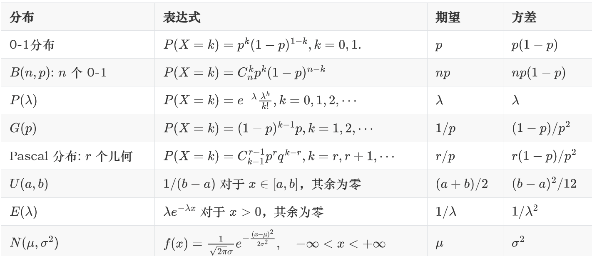

# 概率统计补天

## 几个重要的概率分布
### 几个期望和方差（转载）

### 0-1分布 
$$P(X=k)=p^k(1-p)^{1-k}$$
### 二项分布 
$$P(X=k)=C^k_np^k(1-p)^{n-k}$$
### Pascal分布
$$P(X=k)=C^{r-1}_{k-1}p^r(1-p)^{k-r},k=r,r+1,\cdots$$
&ensp;&ensp;&ensp;&ensp;&ensp;特别地，$r=1$ $$P(X=k)=(1-p)^{k-1}p$$
### Poisson分布
$$P(X=k)=e^{-\lambda}\frac{\lambda^k}{k!},k=0,1,2,\cdots,$$
### 均匀分布
$$
f(x) =
\begin{cases}
\frac{1}{b-a} ,& \text{if } a\le x \le b, \\\\
0 ,&  otherwise,
\end{cases}
$$
### 指数分布
$$
f(x) =
\begin{cases}
\lambda e^{-\lambda x} ,& \text{if } x > 0 \\\\
0 ,& \text{if }  x \le 0
\end{cases}
$$
### 正态分布
$$f(x)=\frac{1}{\sqrt{2\pi}\sigma}e^{-\frac{(x-\mu)^2}{2\sigma^2}},-\infty<x<\infty$$
### 二维联合分布  
&ensp;&ensp;&ensp;&ensp;(一般)画图  
&ensp;&ensp;&ensp;&ensp;二维正态分布$$f(x,y)=\frac{1}{2\pi\sigma_1\sigma_2\sqrt{1-\rho^2}}e^{-\frac{1}{2(1-\rho^2)}[\frac{(x-\mu_1)^2}{\sigma_1^2}-2\rho\frac{(x-\mu_1)(y-\mu_2)}{\sigma_1\sigma_2}+\frac{(y-\mu_2)^2}{\sigma_2^2}]}$$

## 大数定律和中心极限定理
### 预备知识

   - $Chebyshev不等式$

   定义：设随机变量X的数学期望$E(X)=\mu$,方差$D(X)=\sigma^2$,则对于任意正数$\varepsilon$,恒有不等式：
   $$P(|X-\mu|\ge\varepsilon)\le \frac{\sigma^2}{\varepsilon^2} $$  
   
   - 依概率收敛  
   
   定义：设 $Y_1, Y_2, Y_3, \cdots, Y_n, \cdots$是一个随机变量序列，X是一个随机变量，若$\forall \varepsilon>0$有 
   $$ \lim_{n\to \infty}P(|Y_n-X|\ge\varepsilon)=0$$
  &ensp;&ensp;&ensp;&ensp;&ensp;则称该随机变量序列依概率收敛于$X$，记作$Y_n\xrightarrow[n\to\infty]P{} a$.  
###  大数定律  

- 切比雪夫大数定律   

&ensp;&ensp;&ensp;&ensp;&ensp;不相关、依概率收敛

- 辛钦大数定律  

&ensp;&ensp;&ensp;&ensp;&ensp;在切比雪夫大数定律的基础上，$X_n$独立同分布，且依概率收敛

- 伯努利大数定律  

&ensp;&ensp;&ensp;&ensp;&ensp;在辛钦大数定律的基础上附加频率收敛至概率  

### 中心极限定理  

- 列维--林德伯格中心极限定理  

&ensp;&ensp;&ensp;&ensp;&ensp;n个随机变量独立同分布具有相同的期望和方差(需&收敛)，则满足$n\to \infty$时近似于  
&ensp;&ensp;&ensp;&ensp;&ensp;正态分布$N(n\mu,n\sigma^2)$
## 数理统计基本概念
### 总体和样本  

&ensp;&ensp;&ensp;&ensp;&ensp;(1)总体：研究对象的某项数量指标的全体  
  
&ensp;&ensp;&ensp;&ensp;&ensp;(2)个体：总体中的每个元素  

&ensp;&ensp;&ensp;&ensp;&ensp;(3)总体容量：总体中个体的个数  

&ensp;&ensp;&ensp;&ensp;&ensp;(4)简单随机样本：具有同一分布函数的相互独立的随机变量，称$X_1,X_2,\cdots,X_n$
&ensp;&ensp;&ensp;&ensp;&ensp;为简单随机样本。它们的观察值$x_1,x_2,\cdots,x_n$为样本值。  

&ensp;&ensp;&ensp;&ensp;&ensp;(5)样本联合分布：$$ f(x_1,x_2,x_3,\cdots,x_n)=\Pi^n_{i=1}f(x_i)$$&ensp;&ensp;&ensp;&ensp;&ensp;&ensp;&ensp;&ensp;&ensp;&ensp;&ensp;&ensp;&ensp;&ensp;&ensp;(分布函数同理)  

&ensp;&ensp;&ensp;&ensp;&ensp;(6)统计量及抽样分布：简单随机样本的函数叫统计量；统计量的分布叫抽样分布。 

### 常用统计量  

&ensp;&ensp;&ensp;&ensp;&ensp;设$X_1,X_2,\cdots,X_n$是一个来自$X$的样本，它们的观察值为$x_1,x_2,\cdots,x_n$  

&ensp;&ensp;&ensp;&ensp;&ensp;(1)它们的均值为$\bar{X}=\frac{1}{n}\Sigma^n_{i=1}X_i$,  

&ensp;&ensp;&ensp;&ensp;&ensp;(2)样本方差 $S^2=\frac{1}{n-1}\Sigma^n_{i=1}(X_i-\bar{X})^2$(相互独立的样本只有n-1个)  

&ensp;&ensp;&ensp;&ensp;&ensp;(3)k阶原点矩$A^k=\frac{1}{n}\Sigma^n_{i=1}X_i^k$,  

&ensp;&ensp;&ensp;&ensp;&ensp;(4) k阶中心距 减$\bar{X}$作标准处理
  
  &ensp;&ensp;&ensp;&ensp;&ensp;(5)如果$X$的期望和方差都存在，即$E(X)=\mu,D(X)=\sigma^2$,  
  &ensp;&ensp;&ensp;&ensp;&ensp;&ensp;&ensp;&ensp;&ensp;&ensp;则$E(\bar{X})=\mu,D(\bar{X})=\frac{1}{n}\sigma^2,E(S^2)=\sigma^2,D(S^2)=\frac{2\sigma^4}{n-1}$

### 常见抽样分布  
&ensp;&ensp;&ensp;&ensp;&ensp;（1）$\chi^2$分布  

&ensp;&ensp;&ensp;&ensp;&ensp;&ensp;&ensp;&ensp;(i)典型模式   

&ensp;&ensp;&ensp;&ensp;&ensp;&ensp;&ensp;&ensp;&ensp;&ensp;设$X_1,X_2,\cdots X_n$是来自总体$N(0,1)$的样本，则称统计量$\chi^2=\Sigma^n_{i=1}X_i^2$  
&ensp;&ensp;&ensp;&ensp;&ensp;&ensp;&ensp;&ensp;&ensp;&ensp;服从自由度为n的$\chi^2$分布，记为$\chi^2$ ~ $\chi^2(n)$  

&ensp;&ensp;&ensp;&ensp;&ensp;&ensp;&ensp;&ensp;&ensp;&ensp;(ii)$\chi^2$分布的性质  

&ensp;&ensp;&ensp;&ensp;&ensp;&ensp;&ensp;&ensp;&ensp;&ensp;&ensp;&ensp;&ensp;&ensp;&ensp;设$\chi^2_1$ ~ $\chi^2(n_1)$,$\chi^2_2$ ~ $\chi^2(n_2)$,并且相互独立，则$\chi^2_1+\chi^2_2$ ~ $\chi^2(n_1+n_2)$
&ensp;&ensp;&ensp;&ensp;&ensp;&ensp;&ensp;&ensp;&ensp;&ensp;&ensp;&ensp;&ensp;&ensp;&ensp;若$\chi^2$ ~ $\chi^2(n)$，则有$E(\chi^2)=n,D(\chi^2)=2n,$  

&ensp;&ensp;&ensp;&ensp;&ensp;&ensp;&ensp;&ensp;&ensp;&ensp;(iii)$\chi^2$分布的上$\alpha$分点

&ensp;&ensp;&ensp;&ensp;&ensp;(2)t分布
  
  &ensp;&ensp;&ensp;&ensp;&ensp;&ensp;&ensp;&ensp;(i)典型模式   
  
  &ensp;&ensp;&ensp;&ensp;&ensp;&ensp;&ensp;&ensp;&ensp;&ensp;设$X$~$N(0,1)$,$Y$ ~ $\chi^2$(n),且X,Y相互独立，则随机变量$$t=\frac{X}{\sqrt{Y/n}}$$
  &ensp;&ensp;&ensp;&ensp;&ensp;&ensp;&ensp;&ensp;&ensp;&ensp;服从自由度为n的t分布，记作t~t(n)。  

  &ensp;&ensp;&ensp;&ensp;&ensp;&ensp;&ensp;&ensp;&ensp;&ensp;(ii)t分布的性质   

&ensp;&ensp;&ensp;&ensp;&ensp;&ensp;&ensp;&ensp;&ensp;&ensp;$h(t)$的图形关于t=0对称，且有$$\lim_{n\to \infty}h(t)=\frac{1}{\sqrt{2\pi}}e^{-\frac{t^2}{2}}$$,
&ensp;&ensp;&ensp;&ensp;&ensp;&ensp;&ensp;&ensp;&ensp;&ensp;当t足够大时可用中心极限定理(为肥尾)。  

&ensp;&ensp;&ensp;&ensp;&ensp;(3)F分布  

 &ensp;&ensp;&ensp;&ensp;&ensp;&ensp;&ensp;&ensp;(i)典型模式   

  &ensp;&ensp;&ensp;&ensp;&ensp;&ensp;&ensp;&ensp;&ensp;&ensp;设$X$~$\chi^2(m)$,$Y$~$\chi^2(n)$,且X，Y相互独立，则$F=\frac{X/m}{Y/n}$服从自由度为$(m,n)$的  
   &ensp;&ensp;&ensp;&ensp;&ensp;&ensp;&ensp;&ensp;&ensp;&ensp;$F$分布，记为$F$~$F(m,n)$  

   &ensp;&ensp;&ensp;&ensp;&ensp;&ensp;&ensp;&ensp;(ii)$F$分布的性质
     
  &ensp;&ensp;&ensp;&ensp;&ensp;&ensp;&ensp;&ensp;&ensp;&ensp;设$F$~$F(m,n)$,则$\frac{1}{F}$ ~ $F(n,m)$  

### 正态总体的抽样分布  
&ensp;&ensp;&ensp;&ensp;四条简单性质  

&ensp;&ensp;&ensp;&ensp;&ensp;&ensp;&ensp;(1)$\bar{X}$ ~ $N(\mu,\frac{\sigma^2}{n})$,$\frac{\bar{X}-\mu}{\sigma/\sqrt{n}}$ ~ $N(0,1)$  

&ensp;&ensp;&ensp;&ensp;&ensp;&ensp;&ensp;&ensp;(2)$\frac{(n-1)S^2}{\sigma^2}=\frac{1}{\sigma^2}[\Sigma^n_{i=1}(X_i-\bar{X})^2]$~$\chi^2(n-1)$  

&ensp;&ensp;&ensp;&ensp;&ensp;&ensp;&ensp;&ensp;(3)$\frac{\bar{X}-\mu}{S/\sqrt{n}}$与$\frac{(n-1)S^2}{\sigma^2}$相互独立，有$\frac{\bar{X}-\mu}{S/\sqrt{n}}$~$t(n-1)$  

&ensp;&ensp;&ensp;&ensp;&ensp;&ensp;&ensp;&ensp;(4)$\frac{1}{\sigma^2}\Sigma^n_{i=1}(X_i-\mu)^2$~$\chi^2(n)$  

&ensp;&ensp;&ensp;&ensp;两个正态总体的复杂情况  

&ensp;&ensp;&ensp;&ensp;&ensp;&ensp;&ensp;(1)$\bar{X}-\bar{Y}$~$N(\mu_1-\mu_2,\frac{\sigma_1^2}{n_1}+\frac{\sigma_2^2}{n_2})$,亦即$\frac{(\bar{X}-\bar{Y})-(\mu_1-\mu_2)}{\sqrt{\frac{\sigma_1^2}{n_1}+\frac{\sigma_2^2}{n_2}}}$ ~ $N(0,1)$  

&ensp;&ensp;&ensp;&ensp;&ensp;&ensp;&ensp;(2)当$\sigma_1^2=\sigma_2^2$，$\frac{(\bar{X}-\bar{Y})-(\mu_1-\mu_2)}{S_w\sqrt{\frac{1}{n_1}+\frac{1}{n_2}}}$~$t(n_1+n_2-2)$,其中$S_w^2=\frac{(n_1-1)S_1^2+(n_2-1)S_2^2}{n_1+n_2-2}$  

&ensp;&ensp;&ensp;&ensp;&ensp;&ensp;&ensp;(3)$\frac{n_2\sigma_2^2}{n_1\sigma_1^2} \frac{\sum (X_i-\mu_1)^2}{\sum(Y_i-\mu_2)^2}$~$F(n_1,n_2)$

&ensp;&ensp;&ensp;&ensp;&ensp;&ensp;&ensp;(4)$\frac{\sigma^2_2S_1^2}{\sigma_1^2S_2^2}$~$F(n_1-1,n_2-1)$

## 参数估计与假设检验
### 点估计
 
&ensp;&ensp;&ensp;&ensp;（1）矩估计
 
&ensp;&ensp;&ensp;&ensp;&ensp;&ensp;&ensp;&ensp;用样本的k阶原点矩$A_k=\frac{1}{n}\Sigma^n_{i=1}X^k_i$作为总体的$k$阶原点矩$\mu_k=E(X^k)$的估计   

&ensp;&ensp;&ensp;&ensp;（2）最大似然估计  
&ensp;&ensp;&ensp;&ensp;&ensp;&ensp;&ensp;&ensp;（i）离散型随机变量  

&ensp;&ensp;&ensp;&ensp;&ensp;&ensp;&ensp;&ensp;分布律满足$P\{X=x_i\}=p(x_i,\theta),\theta\in\Theta$，则$X_1，X_2,\cdots,X_n$的联合分布

&ensp;&ensp;&ensp;&ensp;&ensp;&ensp;&ensp;&ensp;为$\Pi^n_{i=1}p(x_i;\theta)$  

&ensp;&ensp;&ensp;&ensp;&ensp;&ensp;&ensp;&ensp;又设$x_1,x_2,\cdots,x_n$是相应样本$X_1,X_2,\cdots,X_n$的一个样本值，有  
&ensp;&ensp;&ensp;&ensp;&ensp;&ensp;&ensp;&ensp;$L(\theta)=L(x_1,x_2,\cdots,x_n;\theta)=\Pi^n_{i=1}p(x_i;\theta),\theta\in\Theta$这一概率随$\theta$取值变化  
&ensp;&ensp;&ensp;&ensp;&ensp;&ensp;&ensp;&ensp;而变化，使$L(\theta)$取得最大值的$\hat\theta$作为参数$\theta$的估计值  

&ensp;&ensp;&ensp;&ensp;&ensp;&ensp;&ensp;&ensp;（ii）连续型随机变量  
&ensp;&ensp;&ensp;&ensp;&ensp;&ensp;&ensp;&ensp;类似由概率密度连乘得到（偷懒）

  &ensp;&ensp;&ensp;&ensp;（3）估计量的评选标准  

  &ensp;&ensp;&ensp;&ensp;&ensp;&ensp;&ensp;&ensp;（i）无偏性 

 &ensp;&ensp;&ensp;&ensp;&ensp;&ensp;&ensp;&ensp;若估计量$\hat\theta(X_1,X_2,\cdots,X_n)$有数学期望且$E(\hat\theta)=\theta$,则称$\hat\theta$是无偏的。    

  &ensp;&ensp;&ensp;&ensp;&ensp;&ensp;&ensp;&ensp;（ii）有效性  

  &ensp;&ensp;&ensp;&ensp;&ensp;&ensp;&ensp;&ensp;若估计量$\hat\theta(X_1,X_2,\cdots,X_n)$存在方差$D(\hat\theta)$，则方差越小越有效。  

   &ensp;&ensp;&ensp;&ensp;&ensp;&ensp;&ensp;&ensp;（iii）一致性（相合性）  

   &ensp;&ensp;&ensp;&ensp;&ensp;&ensp;&ensp;&ensp;估计值依概率收敛于真值则两者相合（$n\to \infty$）
### 区间估计  

&ensp;&ensp;&ensp;&ensp;（1）置信区间  

 &ensp;&ensp;&ensp;&ensp;&ensp;&ensp;&ensp;&ensp;由样本确定两个统计量$\theta_1(x_1,x_2,\cdots,x_n)和\theta_2(x_1,x_2,\cdots,x_n)$,  
 &ensp;&ensp;&ensp;&ensp;&ensp;&ensp;&ensp;&ensp;$P\{\theta_1<\theta<\theta_2\}=1-\alpha$'则称区间$(\theta_1,\theta_2)$为参数$\theta$的置信水平为$1-\alpha$的置信区间  

&ensp;&ensp;&ensp;&ensp;（2）正态总体的区间估计  

 &ensp;&ensp;&ensp;&ensp;&ensp;&ensp;&ensp;&ensp;由正态总体的抽样分布的分布情况不难进行估计。

### 假设检验  

&ensp;&ensp;&ensp;&ensp;（1）假设检验  

&ensp;&ensp;&ensp;&ensp;&ensp;&ensp;&ensp;&ensp;（i）假设：零假设、备择假设    

&ensp;&ensp;&ensp;&ensp;&ensp;&ensp;&ensp;&ensp;（ii）两类错误：
$$
\begin{cases}
拒绝实际的假设H_0(\le \alpha), \\\\
接错误情况的假设（\beta）,
\end{cases}
$$  

&ensp;&ensp;&ensp;&ensp;&ensp;&ensp;&ensp;&ensp;（iii）显著性检验（两个边界点$\alpha=0.05，0.01$）

&ensp;&ensp;&ensp;&ensp;&ensp;&ensp;&ensp;&ensp;一般步骤：根据要求提出$H_0,H_1$；给出显著性水平$\alpha$和样本容量n；

&ensp;&ensp;&ensp;&ensp;&ensp;&ensp;&ensp;&ensp;确定检验统计量及拒绝域$W$；计算统计量T的观测值t，$t\in W$时，拒绝原假设$H_0$

&ensp;&ensp;&ensp;&ensp;&ensp;&ensp;&ensp;&ensp;（iv）正态总体的假设检验

&ensp;&ensp;&ensp;&ensp;&ensp;&ensp;&ensp;&ensp;亦有正态分布的抽样分布情况可以进行估计

